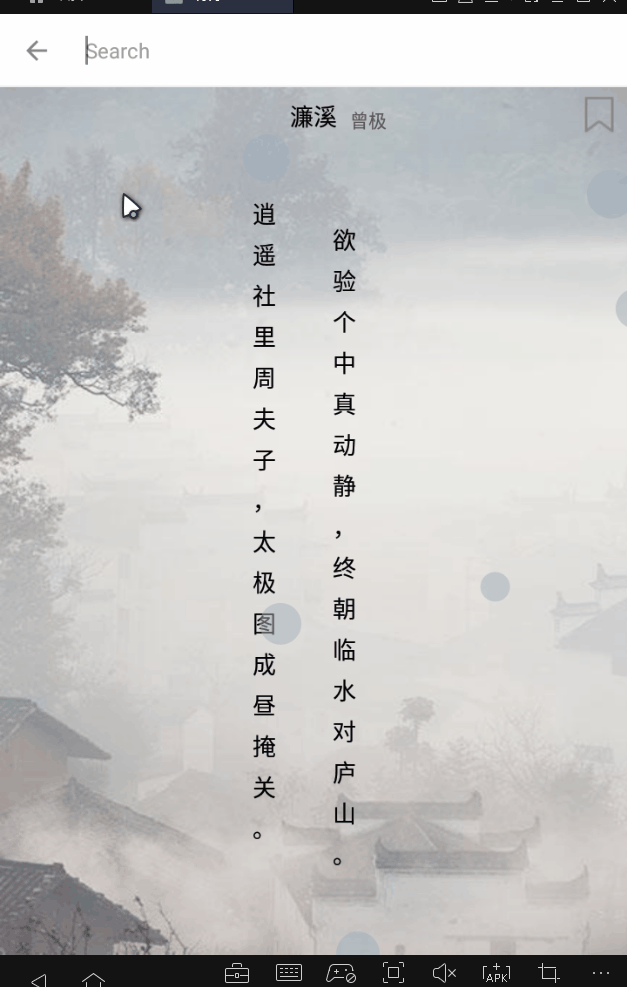

<h1>中国唐诗宋词</h1>
搜索唐诗宋词、相关作者简介、每日推荐诗词
 
唐诗宋词数据库:<a href="https://github.com/chinese-poetry/chinese-poetry">chinese-poetry</a>
 
转换脚本:<a href="https://github.com/KomaBeyond/chinese-poetry-mysql">chinese-poetry-mysql</a>
<h3>后台API:</h3><a href="https://github.com/TIS-OMiddle/2018_27_Li-API-springboot">2018_27_Li-API-springboot</a> ，springboot做的简单接口
 
<h2>效果</h2>
 
 
 
 
 
<h3>todo-list:</h3>
<ul>
    <li><del>唐诗</del></li>
    <li><del>宋词</del></li>
    <li><del>作者</del></li>
    <li><del>收藏</del></li>
    <li><del>分fragment搜索</del></li>
    <li><del>搜索建议</del></li>
    <li><del>刷新随机推荐</del></li>
    <li><del>特效</del></li>
    <li>娱乐彩蛋</li>
    <li><del>调样式、背景</del></li>
    <li><del>登陆(不做了，死代码定好ui)</del></li>
</ul>